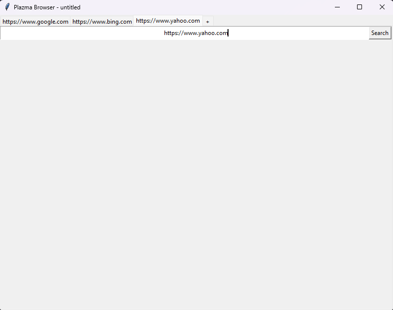

# Plazma Browser

## Plans for Plazma Browser
========================

Features
--------

*   Smooth HTML rendering
*   CSS styling
*   Usable for everyday use
*   Javascript execution
*   Tab support
*   Bookmarks
*   History
*   Settings
*   Customisation
*   Less then 500mb of memory

## Notice: Daily updates were not added to Github as much work had been done to the browser but I knew there are floors with the html tree structure so after a lot longer of working on the project I started from scratch on [Plazma-Browser-V2](https://www.github.com/captaindeathead/plazma-browser-v2)

1/12/2023 daily update
----------------------

*   Basic window
*   Basic tabs
*   New tab button
*   Ctrl-t and Ctrl-w tab hotkeys (open and close tabs)
*   Added search bar and button which calls a function and changes the title

2/12/2023 daily update
----------------------

*   Request urls in search bar
*   Set title of window the the web page title
*   Extract all the 'h' tags and 'p' tags from the document
*   Render the 'h' and 'p' tags to the screen
*   Extract all the 'a' tags
*   Render the 'a' tags to the screen
*   Make the 'a' tags blue and clickable to open the link in the current tab
*   Make the 'a' tags control-clickable to open the link in a new tab
*   Extract all the img tags
*   Convert them all to '.png' format
*   Render them to the screen

3/12/2023 daily update
----------------------

*   Make the 'a' tags blue and clickable to open the link in the current tab
*   Make the 'a' tags control-clickable to open the link in a new tab
*   Extract all the img tags
*   Convert them all to '.png' format
*   Render them to the screen
*   Bind enter to search button
*   Add list support
*   Align contents to the left
*   Add frame and iframe support (just add to html - No container)
*   Add basic css (background color, color)

4/12/2023 daily update
----------------------

*   Add basic css (background-color, color)
*   Replace rgb and rgba styles in css
*   Add link coloring
*   Add 'style=' styling and stylesheet support
*   Add font types

5/12/2023 daily update
----------------------

*   Add basic gradient to color conversion
*   Render the color
*   Remove css comments
*   Add font types
